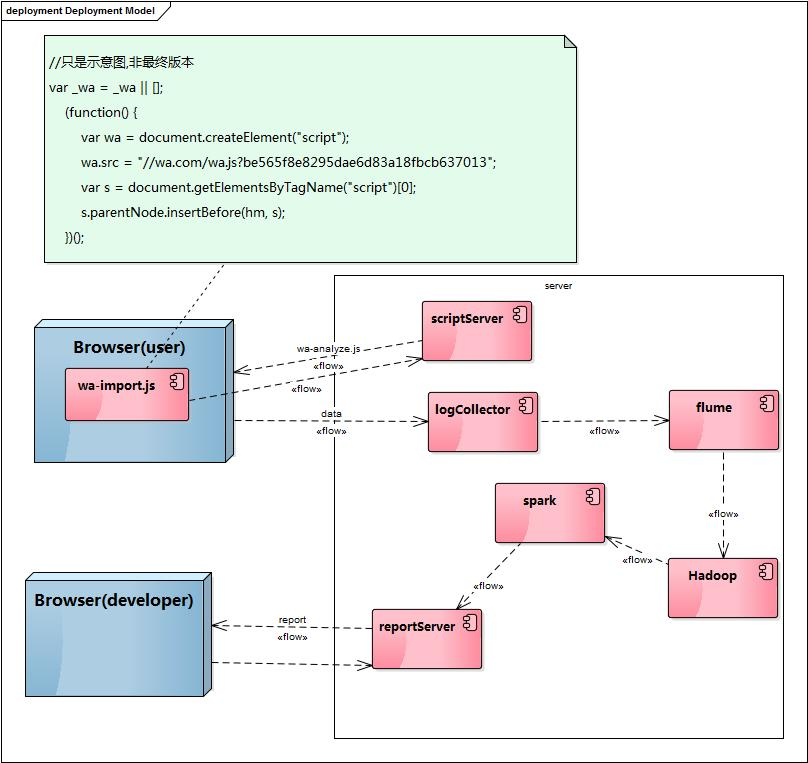

# webAnalyst.js
A powerful tool for collecting data from browser ,analyze page speed,track user action and so on.

### Versions Status And RouteMap
* V 0.1.0
    * note
        * 只包含常用的收集功能等
        * 支持类似ga的API和用法
        * 复杂的自定义功能暂时不考虑
    * status:开发中(under development)
    
* V 0.2.0
    * note
        * 增加一些文档
        * 考虑增加tracker的异步、批量日志功能
        * 考虑增加统计用户在页面中，使用wa命令创建自定义tracker的功能
        * 考虑对localStorage的使用
    * status:NONE

### architecture
below is the webAnalyst architecture:

### Usage

* 目录结构：
    * bin:构建输出
    * conf:配置文件
    * demo:一些演示项目
    * design:设计文档
    * libs:第三方库
    * src:源码
    * test:测试代码
    
    
### TODOs
* (**ING**)DEMO建设
    * (**DONE**)eventTrack
    * (**ING**)trackProxy

* (**DONE**)完成构建工具的选型
    * package manage:NPM
    * build tool:Gulp
    
    
* 完成数据收集框架的设计
    * (**DONE**)优化API设计
        * 参考最新google analyze的风格设计，使用_wa()函数将对数据的操作包装起来：
            * _wa(trackerName,command,param1,param2,param3)
    * (**ING**)完成API风格的设计确定
        * 设定account:_wa.push(['_setAccount','0123456789ABCDEF0123456789ABCDEF'])
        * 开始时间埋点：_wa.push(['_docBegin',performance?performance.now():new Date() ])
            * 建议在head一开始加入这段脚本，记录文档开始执行的时间起点，以便于在不支持performanceAPI的浏览器上，获得相对准确的性能数据
        * 新增日志：_wa.push([trackerName,command,param1,param2,param3...])
        * 自定义时间埋点：wa.push(['_moment',<name>，performance?performance.now():new Date() ])
            * 自定义的时间埋点，可以用来计算自定义的性能数据，比如首屏渲染时间
        * (**DONE**)订阅事件API:
            * _wa.push([trackerName,'on',evtName,function(param){}])
                * _wa.push(['_moment','on','beforeSend',function(name,value){ //handle it }])
                * _wa.push(['_moment','on','afterSend',function(name,value){ //handle it }])
                * _wa.push(['_moment','on','*',function(evtName,name,value){ //handle it }])
    * (**DONE**)完成数据收集方式、发送方式的设计
    * (**DONE**)完成User Case,Deploy Model设计
    
    
* 开发数据收集客户端
    * (**DONE**)Tracker实现
        * 一个tracker有自己的名字，可以执行各种指令
        * 指令可以通过tracker对象调用，也可以通过全局任务队列_wa.push()调用
        * 支持对command处理结果进行订阅
    * (**ING**)built-in tracker封装：
        * (**ING**)page tracker:用于追踪页面PV,UV,**用户访问路径情况**浏览器信息，用户ip...等
            * 对于用户访问路径，考虑定义一些规范的html attr,然后通过body拦截消息来实现自动记录
        * (**DONE**)event tracker:用于提供自定义事件追踪功能
        * performance tracker:用于对页面性能进行分析
            * 这部分tracker主要用于用户对自定义资源性能、自定义规则的页面性能进行追踪
            * 通过将tracker调用放在不同的位置(脚本解析时记录时间),以及指定不同的资源加载开始、结束时间，来实现定制规则的性能分析
            * Resource Timing API,Navigation Timing API的封装
                * 提供util迅速计算resource timing的关键数据
                * 提供util迅速计算和用户关心的页面时间相关的数据
        * resource tracker:
            * 主要对页面直接依赖的资源进行分析
        * ErrorTracker
            * 负责对页面中存在的js错误、资源加载错误等错误情况进行收集和传递
    
    * 优化wa.js:
        * 提供配置功能，可以灵活配置启用哪些tracker,禁用哪些tracker
    * 考虑提供一些接口，能够灵活对接第三方的跟踪器
        * 在一些跟踪动作发生的时候，多个第三方跟踪器都能收到跟踪

* (**DONE**)完成构建环境的搭建

* 开发demo数据收集服务端
    * 利用cookie标识唯一用户
    * 解决数据上传脚本缓存和上传地址更新的矛盾问题
    
    
* 开发demo数据分析端
    * 简单实现一些分析项目：
        * PV,UV等
        * 页面性能分析:
            * 白屏时间
            * 用户可操作时间
            * 首屏时间
            * 总下载时间
        * 资源加载性能分析(支持自定义)
        * 自定义事件分析
        * 用户来源,ip,地域分析
        * 客户端网络状况分析
        * 浏览器新特性兼容性分析
            * 需要搞定不同浏览器Ha的判断
            * 前端脚本可以收集一部分关于浏览器特性的信息，辅助后端进行分析判断
        * ...

### License
MIT